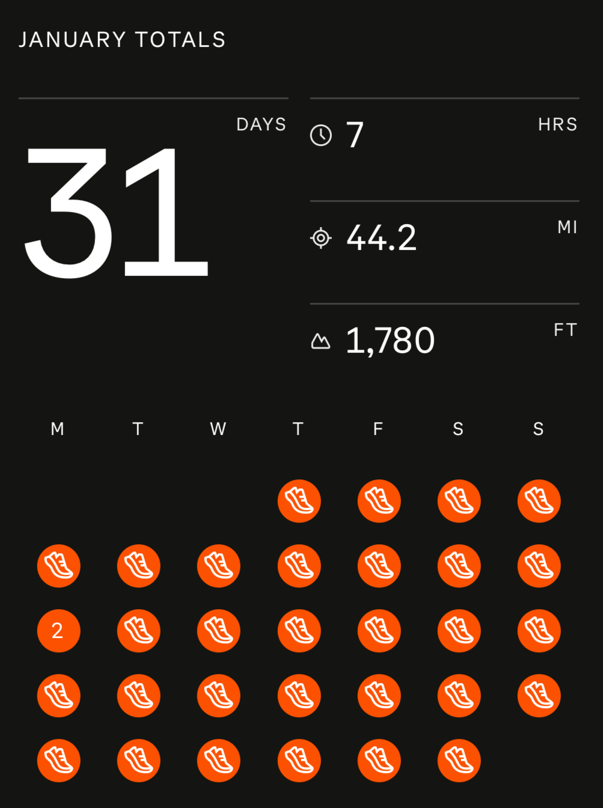

Throughout my life, motivation came in short bursts.
I would have an inspiring conversation with a friend or watch a motivational video on YouTube,
and I would perhaps go to the gym or run or study hard for a day or two, before falling into the exact same habits as before.
Countless times I would lie on my bed thinking how my entire life would change starting tomorrow, only to completely forget about
my resolutions when I wake up.

Noticing this, I then started off-loading my habits and goals to other people.
I would ask my girlfriend to help keep me accountable, or perhaps I would tie habits and goals with other people
(such as running everyday with friends).
The issue with this is that there would almost always be some discrepency in motivation.
My habit is entirely dependant on how motivated my girlfriend is to keeping me accountable, and it's just fundamentally
hard to be motivated in other people's goals and aspirations.
Habits with friends, on the other hand, only works with people who are very committed towards the goal, which can be often hard to find.

I finally realized that I truly needed some level of internal discipline or intrinsic motivation.
However, as seen with my previous short bursts of motivation, I was scared that this desire to be more disciplined
would similarly fall short.

Fortunately, with the New Year rolling around, it was the perfect time to make some resolutions.
I started off with a relatively simple challenge, Running the Date! On 1/1 I would run 1.01 miles,
on 2/15 2.15 miles, and so on.

All things considered, the task itself was not particularly difficuly, 
especially given that there aren't any time constraints related to the challenge.
The true difficulty lies in consistency.
The runs would cause me to sweat after, meaning I would typically have to plan my runs such that
I would be able to shower after.

Furthermore, there would be days where I would be tired, studying until 11\:30 PM and I would have to fight the urge
of just going to sleep.
When Fern (the winter storm) hit, there also weren't many places I could actually run.

However, I noticed that the discipline I was building was starting to trickle into other aspects of my life.
I started valuing my own word more. If I said I would do something, I was much more likely now to actually follow through.

We'll see if I can keep up with the challenge as the months progress, but I really urge anyone to try out doing
some form of mild inconvenience, that ideally is benefitting, everyday.
